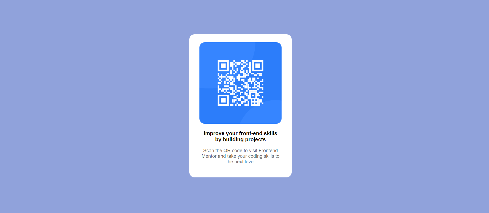

# QR-CODE-COMPONENT

## Project Status
<h3> completed</h3>

- [Overview](#overview)=
  - [Links](#links)
- [My process](#my-process)
  - [Built with](#built-with)
  - [What I learned](#what-i-learned)
  - [Continued development](#continued-development)
- [Author](#author)

## Overview

### Links

- Live Site URL: [Live SIte URL](https://qr-code-component-pied-six.vercel.app/)
- Repo URL: [Repo URL](https://github.com/svandu/qr-code-component)

## My process

### Built with

- Semantic HTML5 markup
- CSS custom properties
- Flexbox

### What I learned

- How to design css to dislay content center
- Flexbox

### Continued development

I continue my development by learning the javascript and the more detail concept of the html and css.

## Author

- Website - [qr-code](https://qr-code-component-pied-six.vercel.app/)
- Frontend Mentor - [@svandu](https://www.frontendmentor.io/profile/svandu)
- Twitter - [@SurbhiVandana](https://twitter.com/SurbhiVandana)